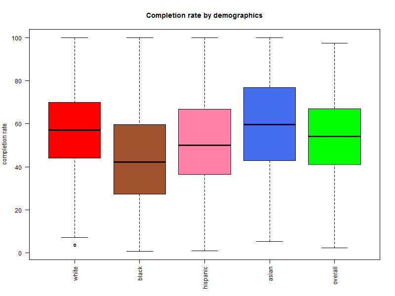

## Introduction | Let's talk about you {.flexbox .vcenter}
<div class="columns-2">
<br />

<br />
<br />
<br />

- You own and operate a charity

- Your goal is to invest money to improve educational outcomes for minority students, mainly African-American and Hispanic

- You want to do this primarily via scholarships and investing in school-specific programs

- You have tasked us with determining the schools whose minority students need the help most

</div>

## Process | Let's talk about us
<div class="columns-2">


- To accomplish this, we look to the College Scorecard data

- Data provided on every institution in America by the US Department of Education

- Attempt to find schools that are not graduating as many minority students as they should be

- These schools are good candidates for financial intervention 


</div>

## Data

- Original raw data file has over 1700 categories of information for each school (variables)...

- ... and over 7,700 individual schools (rows), resulting in an unmanageably gigantic dataset

- we extracted just the 27 variables we used to produce the information in this report

## Data Continued

<div class="centered">

</div>

## Methodology
<div class="columns-2">

```{r echo=FALSE}
load("../data/ridge-black-model.RData")
ridge_black_model <- ridge_model
ridge_black_mse <- ridge_mse
cv_black_ridge <- cv_ridge
ridge_black_lambda_min <- ridge_lambda_min
load("../data/ridge-hisp-model.RData")
load("../data/ols-black-model.RData")
load("../data/ols-hisp-model.RData")
```

- We created two different models to predict a school's black and hispanic graduation rates from other variables in the dataset: OLS and Ridge

- We trained the models using previous years data, and tested them on the current year

- We found that Ridge vastly outperformed OLS, so we used that for our report

| **Group** | **OLS MSE** | **Ridge MSE** |
| :-: | :-: | :-: |
| **Black** | $`r round(ols_mse_black, 3)`$ | $`r round(ridge_black_mse, 3)`$ |
| **Hispanic** | $`r round(ols_mse_hisp, 3)`$ | $`r round(ridge_mse, 3)`$ |
</div>

## Analysis

- Compared predicted graduation rates to actual

- Ordered list with largest negative difference first

- This creates ranking of schools most underperforming expectations

- Restricted results to only "selective" or "highly selective" four-year institutions

## Results | Top 8 Most Underperforming Schools for Black Students{.flexbox .vcenter}
```{r xtable1, echo=FALSE, warning=FALSE, results="asis"}
library(xtable)
load("../data/results-tables.RData")
black_df <- head(over3_black[,c(1,3,4)], 8)
colnames(black_df) <- c("School", "Overall Grad Rate", "Black Grad Rate")
tab <- xtable(black_df, align = "llcc")
print(tab, type = "html", include.rownames = FALSE)
```
<br />
<br />
<br />
<br />
<br />


## Results | Top 8 Most Underperforming Schools for Hispanic Students {.flexbox .vcenter}
```{r xtable2, echo=FALSE, warning=FALSE, results="asis"}
library(xtable)
load("../data/results-tables.RData")
hisp_df <- head(over3_hisp[,c(1,3,4)], 8)
colnames(hisp_df) <- c("School", "Overall Grad Rate", "Hispanic Grad Rate")
tab2 <- xtable(hisp_df, align = "llcc")
print(tab2, type = "html", include.rownames = FALSE)
```
<br />
<br />
<br />
<br />
<br />

## Results | Special Criteria

- For each minority group, we found the 100 most underperforming schools 

- Of those schools, we organized them by the most appealing targets for funding based on a few special criteria

- Meant to highlight certain schools where funding will be stretched further, or the students assisted better positioned upon graduation

## Results | Underperforming Schools with Lowest Cost of Attendance (Black){.flexbox .vcenter}

```{r xtable3, echo=FALSE, warning=FALSE, results="asis"}
colnames(over3_black) <- c("School Name", "Admission Rate", "Overall Grad Rate", "Black Grad Rate", "Black Student Body Proportion", "Total School Size", "Net Cost", "Median Post-Grad Debt", "Median 8-Year Income")
colnames(over3_hisp) <- c("School Name", "Admission Rate", "Overall Grad Rate", "Hispanic Grad Rate", "Hispanic Student Body Proportion", "Total School Size", "Net Cost", "Median Post-Grad Debt", "Median 8-Year Income")
black_100  <- head(over3_black, 100)
black_cheap <- black_100[order(black_100$`Net Cost`),]
tab3 <- xtable(head(black_cheap[,c(1,7)], 8), align = "llc")
print(tab3, type = "html", include.rownames = FALSE)
```
<br />
<br />
<br />
<br />
<br />

## Results | Underperforming Schools with Lowest Cost of Attendance (Hispanic) {.flexbox .vcenter}

```{r xtable4, echo=FALSE, warning=FALSE, results="asis"}
hisp_100  <- head(over3_hisp, 100)
hisp_cheap <- hisp_100[order(hisp_100$`Net Cost`),]
tab4 <- xtable(head(hisp_cheap[,c(1,7)], 8), align = "llc")
print(tab4, type = "html", include.rownames = FALSE)
```
<br />
<br />
<br />
<br />
<br />

## Results | Underperforming Schools with Lowest Median Debt (Black) {.flexbox .vcenter}

```{r xtable5, echo=FALSE, warning=FALSE, results="asis"}
black_debt <- black_100[order(black_100$`Median Post-Grad Debt`),]
tab5 <- xtable(head(black_debt[,c(1,8)], 8), align = "llc")
print(tab5, type = "html", include.rownames = FALSE)
```
<br />
<br />
<br />
<br />
<br />


## Results | Underperforming Schools with Lowest Median Debt (Hispanic) {.flexbox .vcenter}

```{r xtable6, echo=FALSE, warning=FALSE, results="asis"}
hisp_debt <- hisp_100[order(hisp_100$`Median Post-Grad Debt`),]
tab6 <- xtable(head(hisp_debt[,c(1,8)], 8), align = "llc")
print(tab6, type = "html", include.rownames = FALSE)
```
<br />
<br />
<br />
<br />
<br />

## Conclusion


- The Previous lists of schools represent institutions not doing as well as expected when it comes to graduating their minority students

- Any one of which would be a good place to invest money, as their students clearly need support

- Depending on your organizations goals and financial capability, might be worth looking into schools where scholarships cost less or more fully support their students

## Problems Encountered

- Problems mostly revolve around lack of demographic data from College Scorecard

- Despite 1700+ variables, basically only two that had to do with race: graduation rates and school population proportion

- Would be much more helpful to have debt, scholarships, admission rates, retention rates, and more broken up by demographic

- Something important for USDE to look into as improving educational opportunities to minorities is incredibly important to creating a more just world

# Thank You | From Stacy, JD, Phil, and Tim!